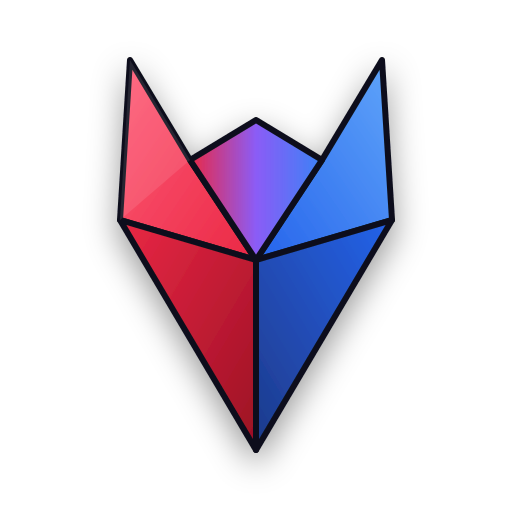

# nest-zod

<p align="center">
  
  <br />
  <a href="https://www.npmjs.com/package/nest-zod">
    
  </a>
  <a href="./LICENSE">
    
  </a>
  <br />
  Zod-powered request parsing and response serialization for NestJS.
</p>

## Features

- Parse request bodies, route params, and query params with Zod schemas
- Serialize handler responses through Zod before sending them back to clients
- Support both runtime-only usage and Swagger / OpenAPI-aware usage
- Keep Nest setup minimal with decorators that register the required pipe or interceptor themselves

## Installation

Requires Node.js 22 or newer.

Install the package and its required peers:

```bash
pnpm add nest-zod zod @nestjs/common rxjs
```

If you want Swagger / OpenAPI metadata too:

```bash
pnpm add @nestjs/swagger
```

Choose one import path:

- `nest-zod`: runtime validation and serialization only
- `nest-zod/swagger`: same runtime behavior, plus Swagger metadata

Most new users who already use `@nestjs/swagger` should start with `nest-zod/swagger`.

## AI Skills

This repo includes AI skills in `skills/`.

Install them with:

```bash
npx skills add taugr/nest-zod
```

Example:

```text
Use $nest-zod-runtime to add runtime-only nest-zod decorators to this NestJS controller.
```

See the [skills guide](https://nestzod.dev/guide/skills) for discovery, installation, and usage details.

## Quick Start

`items.schemas.ts`

```typescript
import { z } from 'zod';

export const createItemSchema = z.object({
  title: z.string().min(1),
});

export const listItemsQuerySchema = z.object({
  page: z.coerce.number().int().positive().default(1),
});

export const itemIdSchema = z.uuid();

export const itemResponseSchema = z.object({
  id: z.uuid(),
  title: z.string(),
});

export type CreateItemDto = z.infer<typeof createItemSchema>;
export type ListItemsQueryDto = z.infer<typeof listItemsQuerySchema>;
export type ItemResponseDto = z.infer<typeof itemResponseSchema>;
```

`items.controller.ts`

```typescript
import { Controller, Get, Post } from '@nestjs/common';
import { ZBody, ZParam, ZQuery, ZSerialize } from 'nest-zod/swagger';

import {
  createItemSchema,
  itemIdSchema,
  itemResponseSchema,
  listItemsQuerySchema,
  type CreateItemDto,
  type ItemResponseDto,
  type ListItemsQueryDto,
} from './items.schemas';

@Controller('items')
export class ItemsController {
  @Post()
  @ZSerialize(itemResponseSchema)
  create(@ZBody(createItemSchema) body: CreateItemDto): ItemResponseDto {
    return {
      id: '550e8400-e29b-41d4-a716-446655440000',
      title: body.title,
    };
  }

  @Get(':id')
  @ZSerialize(itemResponseSchema)
  get(@ZParam('id', itemIdSchema) id: string): ItemResponseDto {
    return {
      id,
      title: 'Widget',
    };
  }

  @Get()
  list(@ZQuery(listItemsQuerySchema) query: ListItemsQueryDto) {
    return {
      page: query.page,
      items: [],
    };
  }
}
```

What the decorators do:

- `ZBody`, `ZParam`, `ZQuery` parse incoming values with Zod
- `ZSerialize` encodes the handler return value with the schema before sending the response

No extra Nest registration is required for these decorators. They attach the needed validation pipe or serializer interceptor themselves, so you do not need `APP_PIPE`, `APP_INTERCEPTOR`, or `useGlobalInterceptors()` for `nest-zod` to work.

For query params, use:

- `ZQuery(schema)` for the whole query object
- `ZQuery('name', schema)` for a named query parameter, including object-shaped values

For schemas with async refinements, transforms, or codecs, enable async mode:

```typescript
@ZParam('id', asyncIdSchema, {
  validation: { async: true },
})
id: string
```

Async response encoding is enabled separately with
`{ serialization: { async: true } }` on `ZSerialize`.

Validation errors use a generic `400` response by default. Applications can
provide `validation.exceptionFactory` when they intentionally want to expose
Zod issues in a custom error envelope.

## Import Paths

Use `nest-zod` when you only want runtime behavior:

```typescript
import { ZBody, ZParam, ZQuery, ZSerialize } from 'nest-zod';
```

Use `nest-zod/swagger` when you also want generated request/response metadata for `SwaggerModule`:

```typescript
import { ZBody, ZParam, ZQuery, ZSerialize } from 'nest-zod/swagger';
```

With `nest-zod/swagger`, `ZSerialize` documents the effective success status for the route:

- `200` by default
- `201` for `@Post()` handlers unless overridden
- an explicit `status` if you pass one to `ZSerialize(..., { status })`

`nest-zod/swagger` also exports:

```typescript
import {
  isZodObjectSchema,
  zodSchemaForEncodedResponse,
  zodToOpenApiSchema,
} from 'nest-zod/swagger';
```

## Playground

This repo includes a small Nest app showing both variants:

- Swagger-backed routes under `/items`
- Runtime-only routes under `/plain-items`

Run it locally:

```bash
pnpm install
pnpm run playground:start
```

Then open:

- API: `http://localhost:3100`
- Swagger UI: `http://localhost:3100/docs`

Useful endpoints:

- `POST /items`
- `GET /items`
- `GET /items/named-query?filter[q]=widget`
- `GET /items/async/:id`
- `GET /items/:id`
- `POST /items/detailed-validation`
- `POST /plain-items`
- `GET /plain-items/:id`
- `GET /items/broken/serialization`

The playground enables Express's extended query parser, so nested query values like
`filter[q]=widget` are parsed into objects before Zod validation runs.

See [Compatibility and limits](https://nestzod.dev/guide/compatibility) for
supported Nest/Swagger versions, async behavior, error customization, OpenAPI
component limitations, and query parser requirements.

For local iteration:

```bash
pnpm run playground:dev
```

## Development

```bash
pnpm install
pnpm run test
pnpm run build
```
